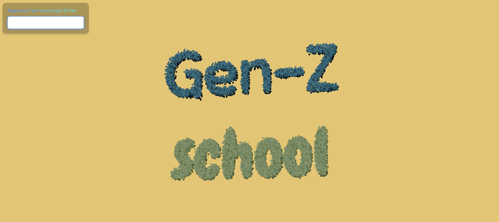

# GenZ AI Text Particle Generator

This is a **3D text particle generator** project built with React and Three.js. The application allows users to input text and combines it with AI-generated words to create dynamic 3D particle effects. It also features a playful chaos animation and randomized background colors.

---

## Features

- **Dynamic 3D Text Particle Visualization**: Converts text into a 3D particle effect.
- **AI-Generated Word Combination**: Combines user-input words with Gen-Z styled humor using OpenAI's API.
- **Chaos Animation**: Adds a chaotic particle effect before transitioning to the final word.
- **Responsive Design**: Automatically adjusts to window size.
- **Randomized Background Colors**: Applies random colors for visual variety.
- **Modern Design Features**: Includes glassmorphism and gradient text styles.

---

## Technologies Used

- **React**: Front-end framework for building UI components.
- **Three.js**: 3D rendering library.
- **@react-three/fiber**: React bindings for Three.js.
- **@react-three/drei**: Useful helpers for Three.js with React.
- **OpenAI API**: Generates creative word combinations.

---

## Screenshots

---

## Demo

Click [here](https://genz-ai-generator.vercel.app/)
