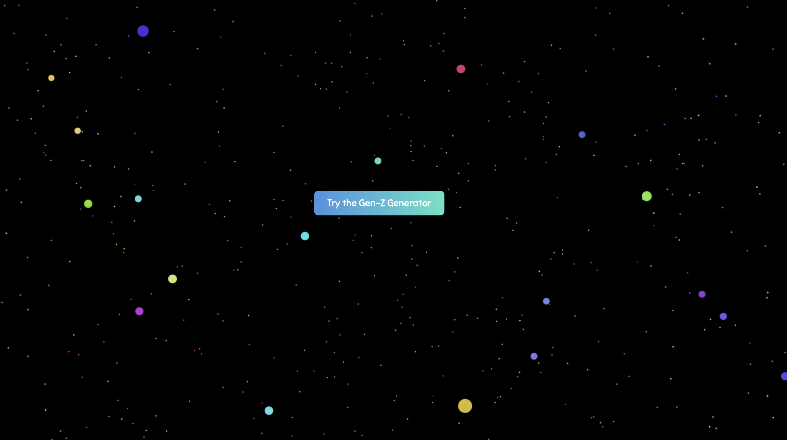
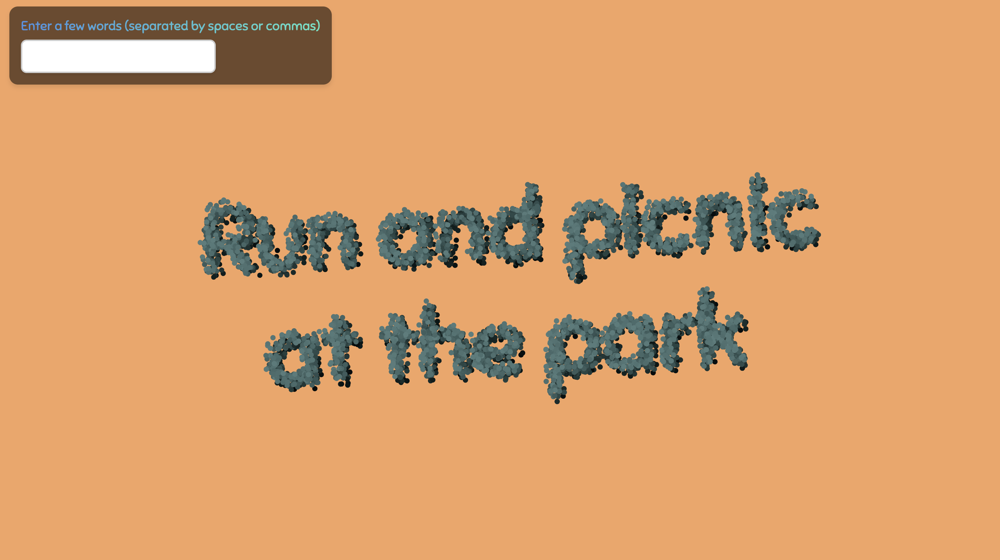

# AI Text Particle Generator

A **3D text particle playground** built with **React** and **Three.js**, powered by **OpenAI**.  
Users input a few words, and the app transforms them into animated particle-based text with a surprise AI-generated Gen-Z-inspired suggestion — complete with chaos effects and vivid background transitions.

---

## Features

- **Dynamic 3D Text Particle Visualization**  
  Renders input text as 3D particle clusters using canvas image processing.

- **AI-Generated Suggestions**  
  Takes user-input words and asks OpenAI to generate a funny, activity or word suggestion.

- **Chaos Animation**  
  Particles disperse in a chaotic animation before reassembling into the AI-generated result.

- **Glassmorphism UI & Gradient Text**  
  Sleek interface with blurred background panels and stylish gradient-label text.

- **Randomized Background Colors**  
  Changes background color with each transition to add visual flair.

- **Responsive & Interactive**  
  Smooth mouse-driven camera panning and automatic resizing for any screen size.

- **Optimized with `useMemo`**  
  Uses `useMemo` to memoize particle geometry and material for performance on large particle counts.

---

## Technologies Used

- **React** – Component-based UI development
- **Three.js** – 3D rendering engine
- **@react-three/fiber** – React bindings for Three.js
- **@react-three/drei** – Helpful abstractions for Three.js in React
- **OpenAI API** – AI word/idea generation
- **Canvas API** – Converts text to pixel data for particle positioning
- **useMemo** – React performance optimization

---

## How It Works

1. User enters words (e.g. _“fun, outdoors, explore”_)
2. Each word is displayed as 3D particle-based text
3. Particles go into chaos mode (random motion)
4. OpenAI API returns a new word or phrase
5. Particles reassemble into the new AI-generated suggestion

---

## Screenshots

---

## Demo

[TEST Here](https://genz-ai-generator.vercel.app/)
